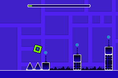

# Geodash GBA
Geodash GBA is a demake of the popular platformer Geometry Dash. The implementation is still work-in-progress.

 

## Building
All required build tools are provided by devkitPro. Follow their [getting started](https://devkitpro.org/wiki/Getting_Started) guide to get set up.  
The GBA rom can then be built by issuing the following make commands:

```sh
$ make tools
$ make assets
$ make utils
$ make build 
$ make levels
```
